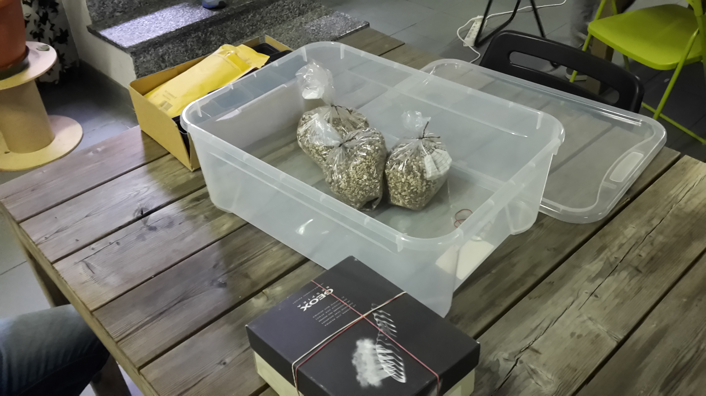
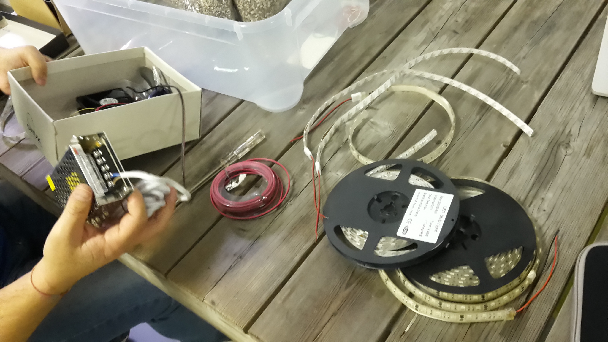
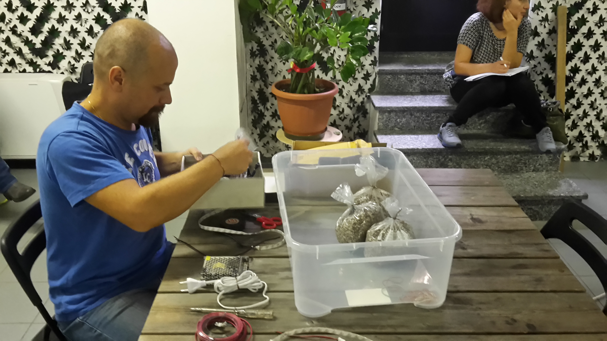
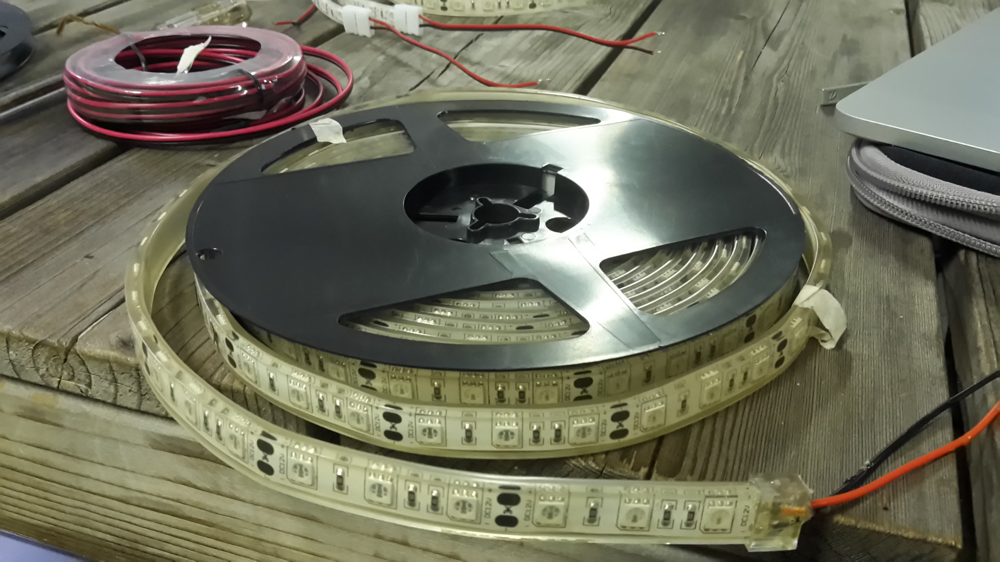
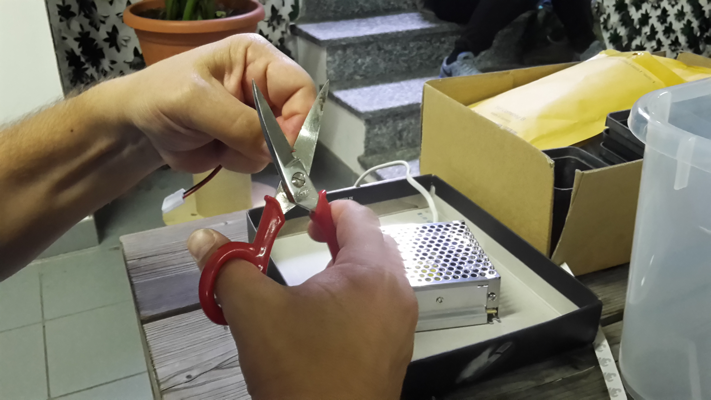
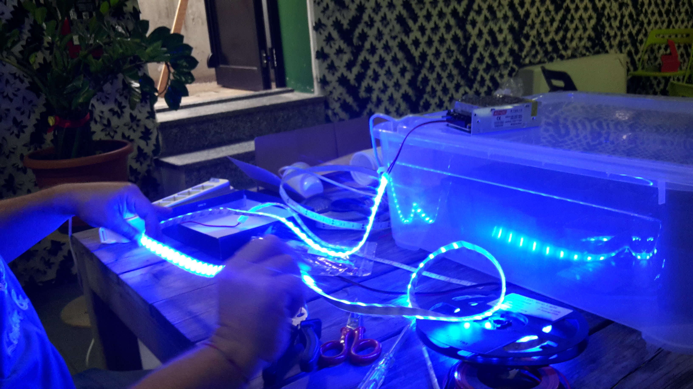
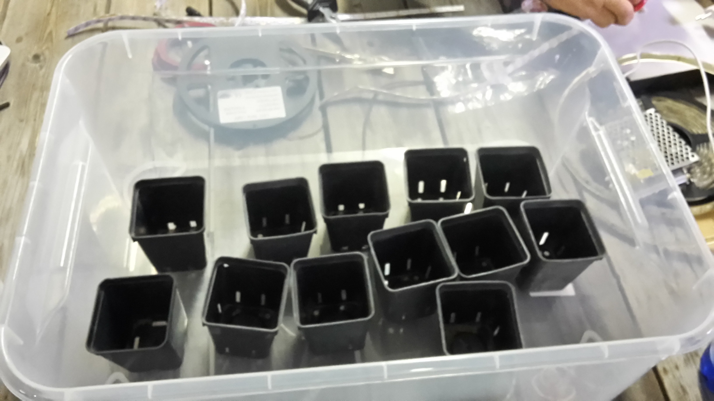
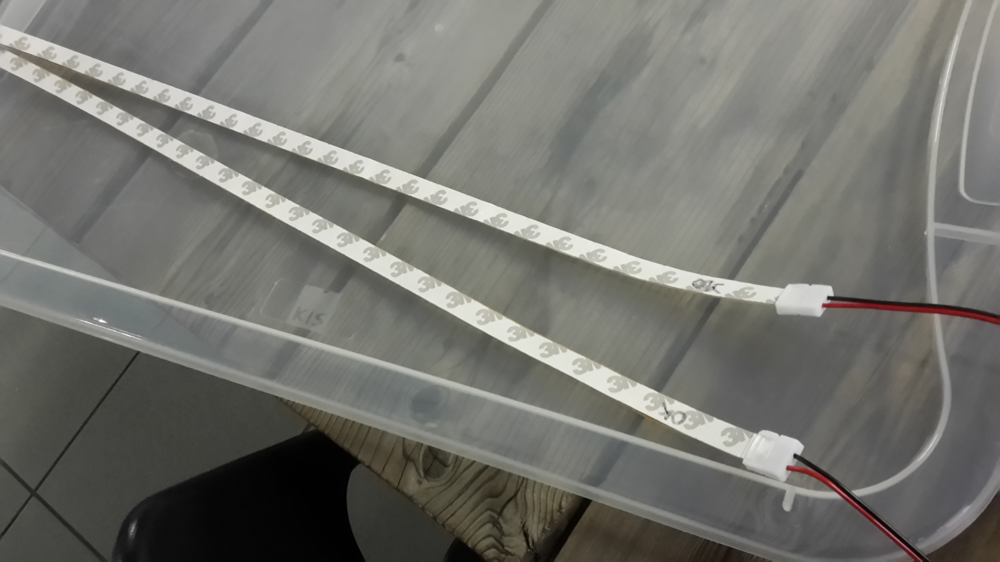
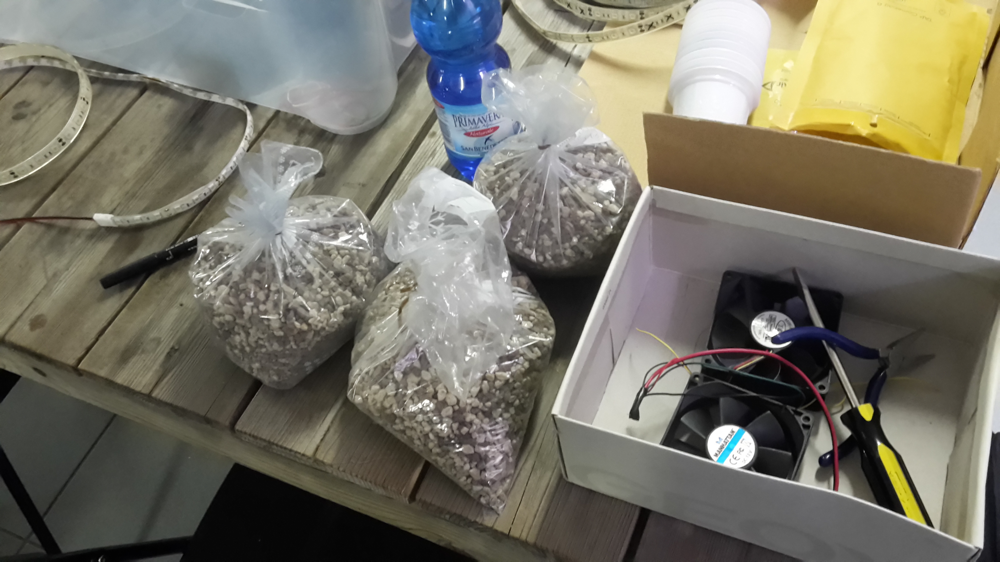
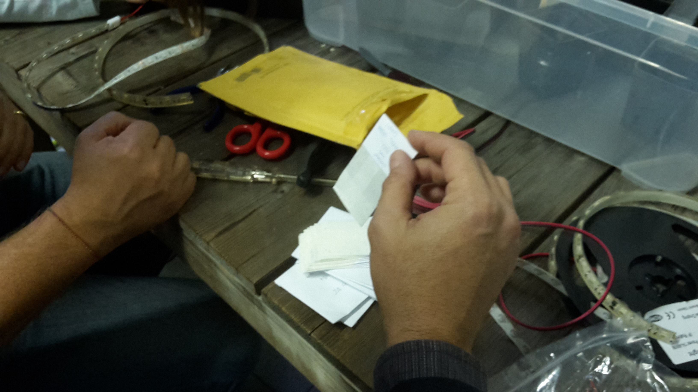

# La scatola

# Il trasformatore che alimentera' la scatola

# Matteo all'opera

# Un rotolo LED

# Un rotolo di cavo elettrico che ci serve per i collegamenti

# Colleghiamo la striscia LED al trasformatore

# Testiamo il funzionamento di una striscia LED

# La scatola ed i vasetti... come li fissiamo?

# Le striscioline LED tagliate e dotate di connettori

# Il terriccio ed un po' di altro materiale

# I semini dei nostri lithops

